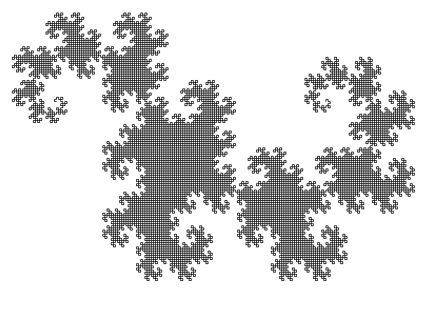
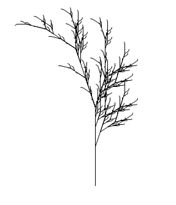
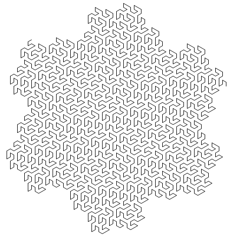

# Fractals generated with L-systems

## Description
A small collection of programs that generate some of well-known fractals using an algorithm based on L-systems. I wrote the program in 2017 when I was learning about fractals and L-systems in university. When developing this, I was highly inspired by the Wikipedia [article](https://en.wikipedia.org/wiki/L-system) about L-systems.

### Dragon curve
**L-system:**
```
variables : F G
constants : + −
start  : F
rules  : (F → F+G), (G → F-G)
angle  : 90°
Here, F and G both mean "draw forward", + means "turn left by angle", and − means "turn right by angle".
```
**Screenshot:**



### Fractal plant
**L-system:**
```
variables : X F
constants : + − [ ]
start  : X
rules  : (X → F+[[X]-X]-F[-FX]+X), (F → FF)
angle  : 25°
Here, F means "draw forward", − means "turn right 25°", and + means "turn left 25°". X does not correspond to any drawing action and is used to control the evolution of the curve. The square bracket "[" corresponds to saving the current values for position and angle, which are restored when the corresponding "]" is executed.
```
**Screenshot:**



### Gosper curve
**L-system:**
```
angle : 60 degrees
axiom : A
replacement rules :
  A → A-B--B+A++AA+B-
  B → +A-BB--B-A++A+B
In this case both A and B mean to move forward, + means to turn left 60 degrees and - means to turn right 60 degrees - using a "turtle"-style program such as Logo.
```
**Screenshot:**



## Requirements
[PascalABC.NET](http://pascalabc.net/en/download) is required to run the program.

## Quick start
1. Launch PascalABC.NET.
2. Open the file corresponding to a fractal image you want to see (`dragon.pas`, `fractal plant.pas` or `gosper.pas`).
3. Run the program.
